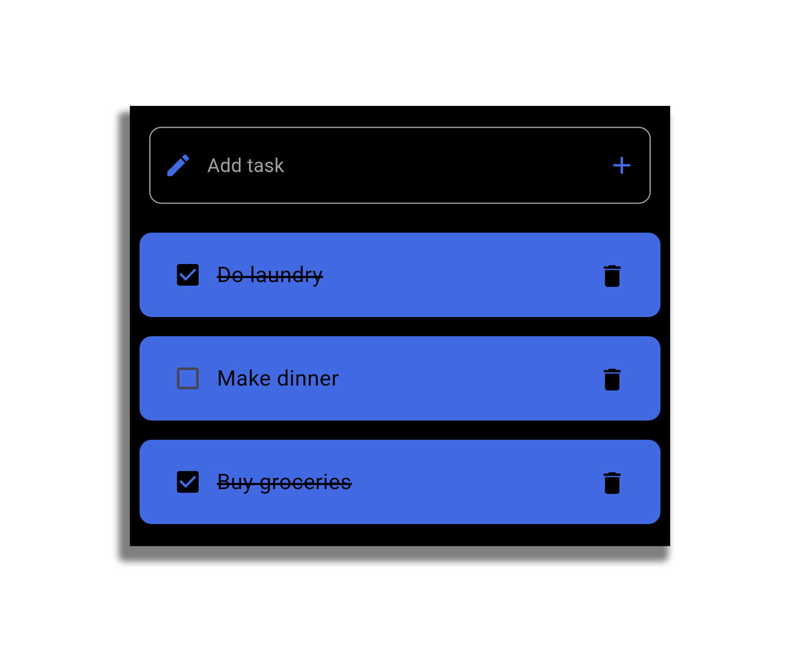

# ToDo App

## Overview

This ToDo app is a task management application that allows users to add, complete, and delete tasks. It is built using Flutter for the frontend and Node.js with MongoDB for the backend. The app features a clean and intuitive user interface with a consistent design.


## Features

- Add new tasks
- Mark tasks as completed or uncompleted
- Delete tasks
- Persistent storage using MongoDB
- Real-time updates

## Technology Stack

- **Frontend**: Flutter
- **Backend**: Node.js
- **Database**: MongoDB
- **API Hosting**: Render.com


## Project Structure

### Frontend

The frontend of the application is built using Flutter. It follows an industry-standard structure for easy maintenance, reusable widgets, and increased readability.

#### Key Components

- **CustomTitle**: Widget for displaying titles.
- **ErrorText**: Widget for displaying error messages.
- **CustomTextField**: Custom text field widget with a configurable prefix icon and onPressed function.
- **TaskDisplay**: Widget for displaying individual tasks with a checkbox and delete button.

### Backend

The backend is built using Node.js with Express.js to create a RESTful API. MongoDB is used as the database with Mongoose for schema definitions and interactions.

#### Key Routes

- **POST /tasks**: Adds a new task
- **GET /tasks**: Retrieves all tasks
- **PUT /tasks/:id**: Toggles the completion status of a task
- **DELETE /tasks/:id**: Deletes a task

## Installation and Setup

### Prerequisites

- Flutter SDK
- Node.js
- MongoDB

### Frontend Setup

1. **Clone the repository**

   ```sh
   git clone https://github.com/2manas8/To-Do_App
   cd todo-app
   ```

2. **Install dependencies**

   ```sh
   flutter pub get
   ```

3. **Run the app**

   ```sh
   flutter run
   ```

### Backend Setup

1. **Navigate to the backend directory**

   ```sh
   cd backend
   ```

2. **Install dependencies**

   ```sh
   npm install
   ```

3. **Set up environment variables**

   Create a `.env` file in the root of the `backend` directory and add your MongoDB connection string:

   ```env
   MONGO_URI=mongodb+srv://<username>:<password>@cluster0.mongodb.net/todo?retryWrites=true&w=majority
   ```

4. **Run the server**

   ```sh
   npm start
   ```

### MongoDB Setup

1. **Create a MongoDB Atlas account**: If you don't have one, create an account at [MongoDB Atlas](https://www.mongodb.com/cloud/atlas).
2. **Set up a new cluster**: Follow the instructions to create a new cluster.
3. **Get the connection string**: Obtain the connection string for your MongoDB database and replace the placeholder in the `.env` file.

## Usage

1. **Add a task**: Enter a task in the input field and press the add button.

2. **Complete a task**: Check the checkbox next to a task to mark it as completed.

   

3. **Delete a task**: Press the delete button next to a task to remove it from the list.